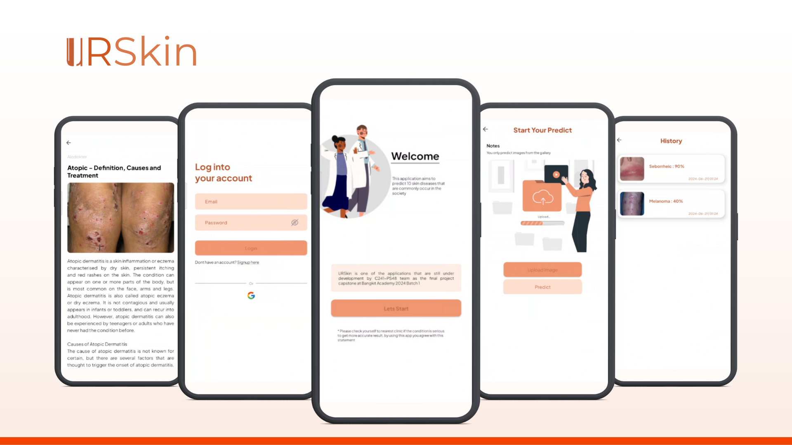

# URSkin

  

## About The App

      

 

URSkin is a mobile application that can classify skin diseases based on images. This application provide users with insights into general conditions, such as possible causes, and recommends appropriate actions.

## Features
- [x] Login and Register User
- [x] Image-based Analysis
- [x] Displaying Analysis Results
- [x] History Analysis
- [x] Skin Disease Articles
- [x] User Profile
